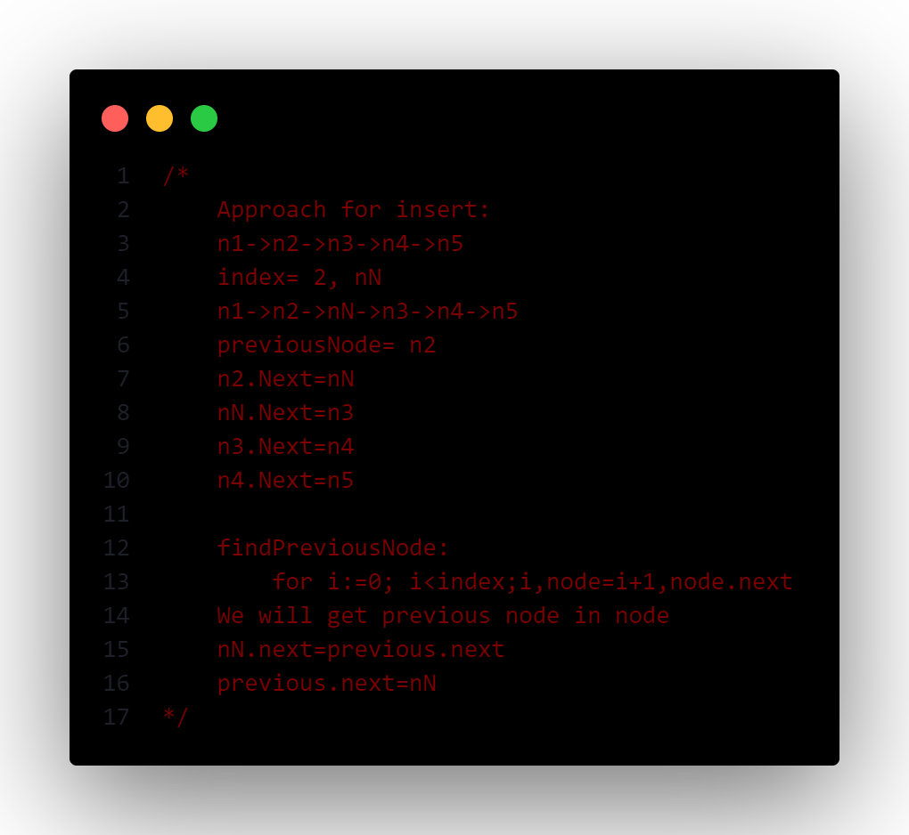

## TOC
- [dsa_go](#dsa_go)
- [Topics Covered](#topics-covered)

# dsa_go
**dsa_go** implements various core *data-structures* which are not available in golang natively.

Checkout implemented data-structures [here](#topics-covered).

Along with implementing these data-structures there are **leetcode problem solutions** using these very data-structures.

Approach for implementing operations on each data-structure is explained like this:

Problem statememnt and solution to problems are described in comments above the code, like this:

# Topics Covered
- [Array/Slice](./array/)
- [String](./string/)
- [LinkedLists](./linkedlist/)
- [Stack](./stack/)
- [Queue](./queue/)
- [Binary Tree](./tree/)
- [Binary Heaps](./heap/)
- [Hashing](./hashing/)

> I'll add more data structures and problem solutions in coming days. Cheers!
