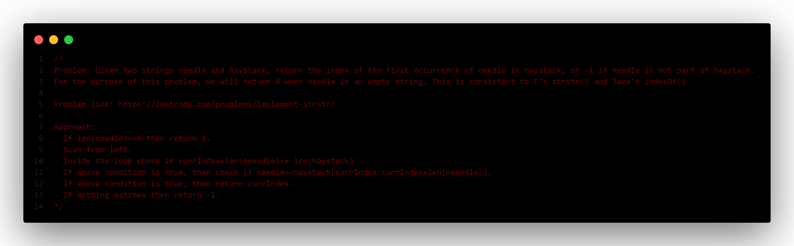

## TOC
- [dsa_go](#dsa_go)
- [Topics Covered](#topics-covered)

# dsa_go
This is a repository with dsa problems solved using GoLang.

Problem statememnt and solution to problems are described in comments above the code, like this:

# Topics Covered
- [Array/Slice](./array/)
- [String](./string/)
- [LinkedLists](./linkedlist/)
- [Stack](./stack/)
- [Queue](./queue/)

> I'll add more problem solutions in coming days. Cheers!
